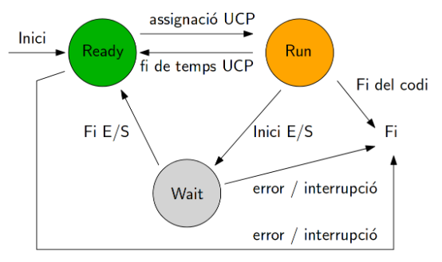

# Estats dels Processos
Els processos, en el seu cicle de vida, passen per diversos estats que reflecteixen la seva activitat i disponibilitat. Comprendre aquests estats és fonamental per gestionar eficaçment els recursos del sistema. A continuació, es detallen els principals estats dels processos

1. **Ready (Preparat):** En aquest estat, el procés ha estat creat i està preparat per ser executat, però encara no ha rebut temps de CPU. Es troba a la cua d'espera del planificador de CPU per obtenir l'oportunitat d'executar-se.

2. **Running (En Execució):** Quan el procés obté temps de CPU, passa a l'estat "Running". En aquest estat, les instruccions del programa estan sent executades activament pel processador.

3. **Blocked (Bloquejat):** El procés pot entrar a aquest estat quan espera alguna condició per continuar la seva execució. Aquesta condició pot ser l'entrada d'informació de l'usuari, l'arribada de dades d'E/S, o altres esdeveniments externs. Mentre està bloquejat, el procés no utilitza temps de CPU.

4. **Terminated (Finalitzat):** Quan el procés ha completat la seva tasca, ja sigui normalment o a causa d'un error, entra a l'estat "Terminated". En aquest punt, es poden alliberar els recursos que ocupava i es pot informar del seu estat final.

La transició entre aquests estats pot ser provocada per diverses causes, com ara:

- **Creació del Procés:** Quan es crea un procés, inicialment es troba en l'estat "Ready".

- **Planificació de la CPU:** El planificador de la CPU decideix quin procés es selecciona per a l'execució i passa de l'estat "Ready" a l'estat "Running".

- **Entrada/Sortida:** Quan un procés ha de realitzar una operació d'entrada/sortida, pot passar a l'estat "Blocked" fins que es compleixi la condició necessària.

- **Finalització de l'Execució:** Quan el procés ha completat la seva tasca, ja sigui amb èxit o amb un error, passa a l'estat "Terminated".

És important destacar que aquests estats i les seves transicions poden variar lleugerament segons el sistema operatiu i el model de gestió de processos utilitzat. Els sistemes operatius moderns implementen algorismes de planificació sofisticats per assegurar-se que els processos s'executen de manera eficient i justa en un entorn multitasca.
## Transició de Processos

[Readme](readme.md)
