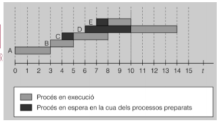

# Planificació
Quan tenim més d’un procés en marxa, el SO ha de planificar quin procés s’executa en cada moment.

**Planificador (Scheduler)**

Temps importants en la planificació de processos:

- **Temps de resposta:** Quant triga el SO en donar-me servei.
- **Temps de servei:** Temps que es triga en servir la petició. Inclou el temps d’espera + el d’execució en CPU.
- **Temps de processador:** Temps de servei - temps d’espera a cua.
- **Temps d’espera:** Temps a cua.
- **Eficiència:** Temps de processador / temps total.
- **Rendiment:** Processos executats per unitat de temps.

Segons com el SO assigna temps de CPU a cada procés, tenim els següents algoritmes de planificació:

1. **FIFO:** El primer que entra, el primer que surt.

2. **Round Robin:** Repartim el temps entre els processos que esperen.

3. **SJF:** Executem primer els processos més curts.

4. **SRT:** Primer els processos amb temps restant més curt.

5. **Prioritats**

[Readme](readme.md)